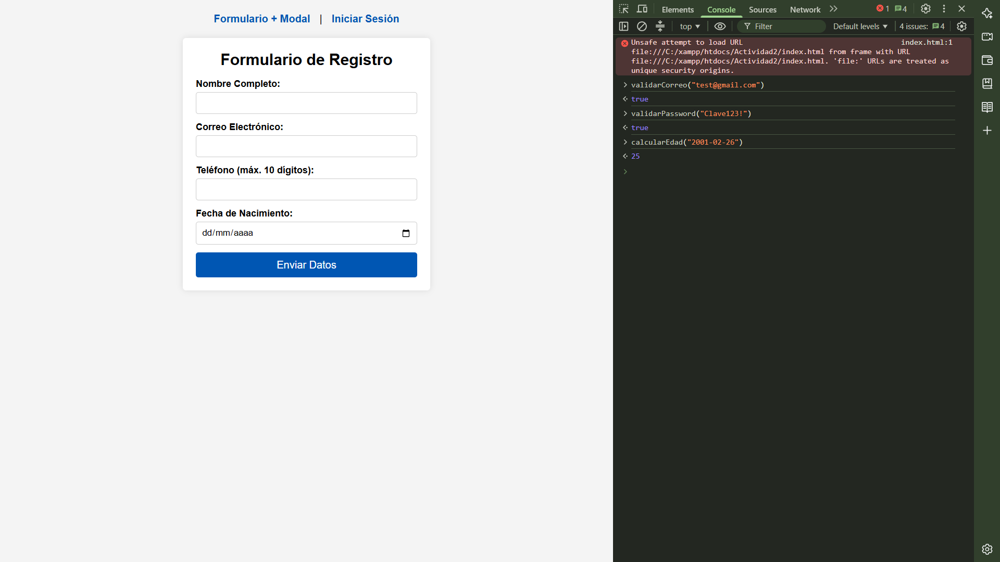
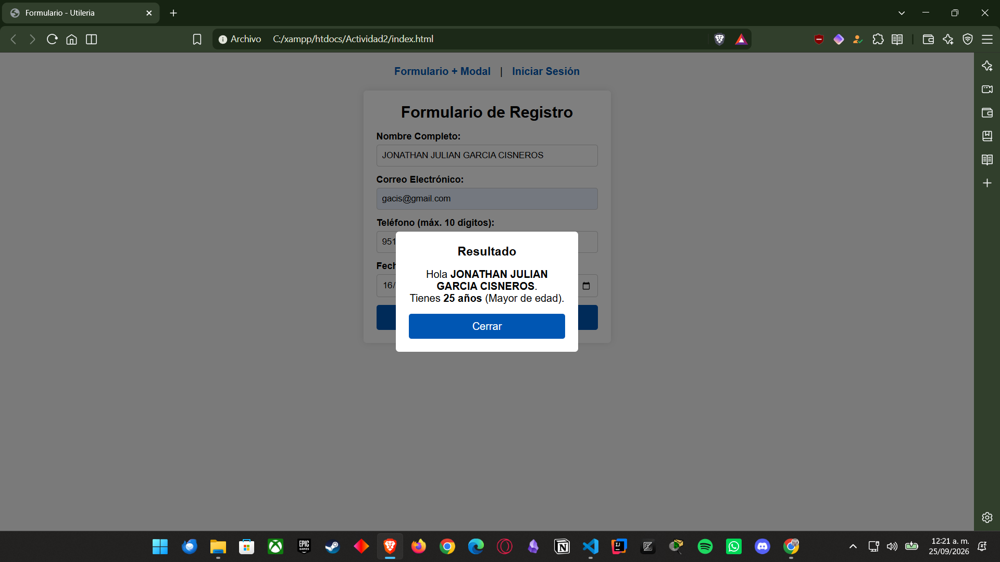
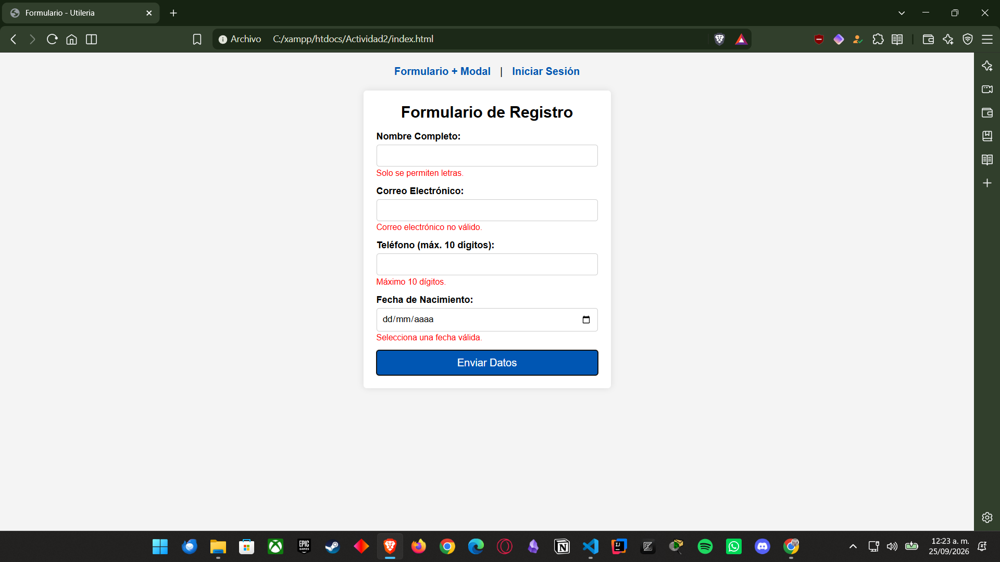
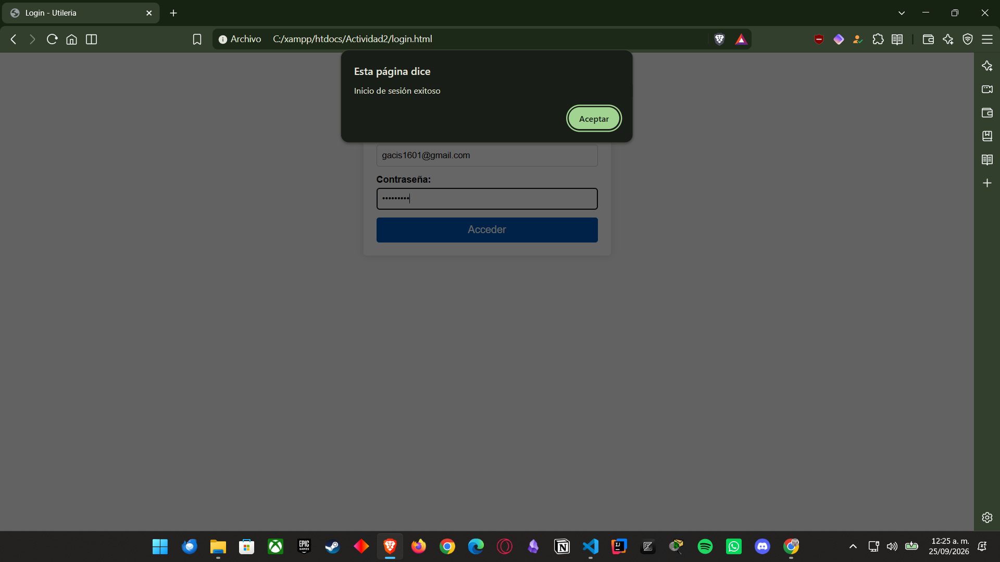

# Librería utileria.js

**Nombre:** Julian  
**Problema que resuelve:** `utileria.js` es una librería en JavaScript puro que simplifica la validación de formularios (correos, contraseñas seguras, números y letras), el cálculo de fechas/edad y transformaciones de texto sin depender de librerías o frameworks externos.

---

## Instalación

Para utilizar esta librería en tu proyecto HTML, incluye el script antes del cierre del cuerpo (`</body>`):

```html
<script src="js/utileria.js"></script>
```

---

## Uso con ejemplos de código

### 1. Validar Correo Electrónico
```javascript
let esCorreoValido = validarCorreo("usuario@correo.com");
console.log(esCorreoValido); // true
```

### 2. Solo Letras
```javascript
let esTexto = soloLetras("Juan Pérez");
console.log(esTexto); // true
```

### 3. Validar Longitud de un Número
```javascript
let longitudCorrecta = validarLongitud("9511234567", 10);
console.log(longitudCorrecta); // true
```

### 4. Calcular Edad y Mayoría de Edad
```javascript
let edad = calcularEdad("2002-05-20");
let esMayor = esMayorDeEdad("2002-05-20");
console.log(edad);    // Edad en número entero
console.log(esMayor); // true
```

### 5. Validar Contraseña Segura
```javascript
let esPasswordValida = validarPassword("Password123!");
console.log(esPasswordValida); // true
```

### 6. Funciones Propias (Sección Libre)
```javascript
let mayus = convertirMayusculas("hola mundo");
console.log(mayus); // "HOLA MUNDO"

let esPar = esNumeroPar(8);
console.log(esPar); // true
```

---

## Capturas de Pantalla

### 1. Ejecución de Funciones en Consola


*Figura 1: Pruebas en tiempo real desde la consola del navegador ejecutando las funciones `validarCorreo`, `validarPassword` y `calcularEdad`.*

### 2. Formulario y Ventana Modal con Edad Calculada


*Figura 2: Integración del formulario de registro y despliegue de la edad calculada dentro de la ventana modal mediante la librería.*

### 3. Validaciones del Formulario


*Figura 3: Activación de las alertas de error en rojo al intentar enviar datos vacíos o con formato incorrecto.*

### 4. Módulo de Login


*Figura 4: Formulario de inicio de sesión integrando las funciones `validarCorreo` y `validarPassword`.*

---

## Video Promocional (Máx. 1 min)

[Enlace al video de demostración aquí]